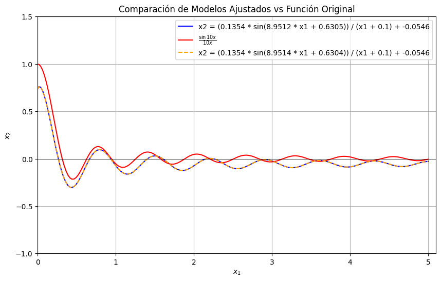

# Escuela Politécnica Nacional

## Métodos Numéricos

## Informe Técnico: Proyecto Blackbox S

---
**Integrantes:** Alangasí Anthony, Nicole Achote, Danny Caiza

**Curso:** GR1CC

**Grupo:** 8

---

## 1. Introducción

Las redes neuronales han adquirido un papel muy importante en la modelación de fenómenos complejos debido a su capacidad para representar relaciones no lineales entre variables. En este tipo de sistemas, se dispone únicamente de sus entradas y salidas, pero no de una expresión analítica exacta que determine su comportamiento interno entre sus entradas y salidas. En estos casos, surge la necesidad de emplear métodos numéricos que permitan inferir o aproximar la relación analítica que existe entre ellas.

El presente proyecto tiene como objetivo estudiar la red neuronal Blackbox S, la cual implementa una función paramétrica $$fθ:R2→B$$ que asigna un valor binario a cada par de valores $$(x_1, x_2)$$con la condición $$x_1 \ge 0$$ Si bien el modelo permite obtener predicciones para cualquier punto del dominio, la dependencia analítica entre las variables $x_1$ y $x_2$ sigue sin ser conocida explícitamente. Por ello, el objetivo principal es determinar la relación matemática que existe entre estas ambas variables utilizando técnicas de optimización no lineal, fundamentadas en métodos numéricos.

Para ello se aplican dos métodos numéricos utilizados comúnmente en problemas de optimización y ajuste de modelos que son Gauss-Newton y Levenberg–Marquardt. Estos métodos permiten estimar parámetros mediante la minimización del error entre valores observados y valores generados por la función objetivo. La comparación de estos valores permite evaluar diferencias en precisión, velocidad de convergencia y estabilidad numérica.

Finalmente, se hace la comparación y la interpretación de los resultados obtenidos por cada método, determinando cual proporciona una aproximación más adecuada a la relación analítica buscada.  Se destaca también la importancia de los métodos numéricos para el estudio de modelos cuyo comportamiento no se presenta en forma explícita.

---

## 2. Metodología

**2.1. Desarrollo Matemático y Modelo Analítico**
**Identificación de la función subyacente (Sinc Amortiguada) basada en la visualización.**

<br>

A partir del análisis gráfico de los puntos donde la red neuronal cambia de salida entre las clases 0 y 1, se observó que la frontera de decisión presenta un comportamiento oscilatorio y decreciente, una característica muy notable de funciones tipo Sinc:
$$\text{sinc}(x) = \frac{\sin(kx)}{kx}$$
En particular, la forma de las fronteras sugiere que el patrón subyacente sigue un comportamiento similar a:
$$\text{sinc}(x) = \frac{\sin(10x)}{10x}$$

Sin embargo, al comparar esta función ideal con los datos generados por la red, fue necesario introducir dos modificaciones para ajustarla correctamente:

<br>

Amortiguación artificial (Blackbox) para evitar la singularidad en x=0:

<br>


$$\frac{1}{x} \longrightarrow \frac{1}{x + 0.1}$$

<br>

Ajuste paramétrico general para modelar correctamente la amplitud, frecuencia, desfase y desplzamiento vertical propios de la frontera aprendida:

<br>

$$X_2 = A \cdot \frac{\sin(B x_1 + C)}{x_1 + 0.1} + D$$

<br>

Este modelo constituye una **Sinc amortiguada paramétrica**, que analiza el comportamiento oscilatorio de la frontera, pero a su vez permite adaptarlo a los valores reales detectados por los métodos del algoritmo.

<br>

**Formulación de las dos ecuaciones de la frontera superior e inferior**

<br>

Durante el muestreo sistemático del plano $(x_1,x_2)$, la red neuronal tenia como clasificación; **0** o **1**. A partir de esta clasificación se identificaron dos tipos de transiciones:

<br>

**Frontera Superior ($1\longrightarrow0$)**
Corresponde a los puntos en donde, al aumentar x<sub>2</sub>, la red cambia su predicción desde 1 hacia 0.Es decir, se delimita el limite superior de la banda donde la red considera salida = 1.
Esto, en un dialecto matemáticoe,quiere decir que la fronte fue modelada mediante un Sinc amortiguada con parámetros ajustados usando **curve_fit o Metodo de Levenberg-Marquardt:**

<br>

$$x_2^{up}(x_1) = A_{sup} \cdot \frac{\sin(B_{sup} \, x_1 + C_{sup})}{x_1 + 0.1} + D_{sup}$$

<br>

Los parametros A<sub>sup</sub>,B<sub>sup</sub>,C<sub>sup</sub>,D<sub>sup</sub> representan el ajuste optimo obetenido a partil del conjunto **frontera_superior**<br>

<br>

**Frontera Inferior ($0\longrightarrow1$)**

<br>

Corresponde a los punto donde, al disminuir x<sub>2</sub>, la red cambia su prediccion desde 0 hacia 1.
Define el **limite inferior** de la region donde la red activa la salida = 1.
Para esta formulacion analitica, se siguio el mismo modelo amortiguado, pero con parametros diferentes:

<br>

$$x_2^{up}(x_1) = A_{inf} \cdot \frac{\sin(B_{inf}\, x_1 + C_{inf})}{x_1 + 0.1} + D_{inf}$$

<br>

Los parametros a evaluar se obtuvieron el método de Guss-Newton y se contrastaron numéricamente con la aproximación de Levenberg-Marquardt para validad la equivalencia del ajuste.

<br>

**2.2. Descripción de la Implementación:**

<br>

**2.2.1. Muestreo de la Frontera (Doble Bisección)**

<br>

Con la finalización del alcance del objetivo de obtener una representación precisa de las fronteras de decisión de la red Neuronal BlackBox S, se implemento un algoritmo de muestreo mediante una doble bisección. Dado que este método permite localizar con alta exactitud los puntos donde la red cambia su salida entre 0 y , lo cual defina una banda en la que la funcion de la red es igual a 1.

Dado los pasos a seguir del algoritmo, fueron:

<br>

**a) Exploración inicial**

<br>

Para cada valor de 𝑥 1 x 1 ​ dentro del intervalo estudiado, se realizó un muestreo preliminar sobre un rango definido de valores de $𝑥_2$. Este muestreo permite identificar de manera aproximada la región donde ocurre una transición abrupta en la salida de la red, ya sea:

  • **De 1 a 0**(frontera superior)

  • **De 0 a 1**(frontera inferior)

Este punto inicial sirve como referencia para el refinamiento posterior

<br>

**b) Bisección para la Frontera Superior ($1\longrightarrow0$)** 

<br>

Una vez detectado un punto aproximado donde la red deja de clasificar como 1, se define un intervalo [x<sub>2low</sub>, 𝑥<sub>2high</sub>] que contiene la transición. Sobre este intervalo se aplica el método de bisección clásica, evaluando la red en el punto medio:

$$
X_{2mid} = \frac{X_2 + X_{2high}}{2}
$$

Dependiendo del valor de la red neuronal:

  • Si 𝑓(𝑥<sub>1</sub>,𝑥<sub>2mid</sub>) = 1, se actualiza el límite inferior.

  • Si 𝑓(𝑥<sub>1</sub>,𝑥<sub>2mid</sub>) = 0, se actualiza el límite superior.

Este proceso se repite hasta que:

$$
|x_{2,high} - x_{2,low}| < \epsilon
$$

donde la tolerancia utilizada fue:

$$
\epsilon = 10^{-5}
$$

El valor final se registra como punto preciso de la frontera superior.

<br>

**c) Bisección para la Frontera Inferior (0 → 1)**

<br>

De forma análoga, se construyó un intervalo que contiene la transición desde salida 0 hacia acceso 1. Se aplica nuevamente el método de bisección, pero con la lógica invertida:

  • Si 𝑓(𝑥<sub>1</sub>,𝑥<sub>2mid</sub>) = 0, la transición esta hacia valores superiores.

  • Si 𝑓(𝑥<sub>1</sub>,𝑥<sub>2mid</sub>) = 1, la transición esta hacia valores superiores.

Este proceso determina con precisión el punto que pertenece a la frontera inferior.

<br>

**2.2.2. Método Numérico 1: Levenberg-Marquardt (L-M):** 

<br>

Con el propósito de obtener un modelo analítico que describiera con precisión la forma de la frontera inferior identificada en el proceso de muestreo, se aplicó un procedimiento de regresión no lineal mediante el algoritmo de **Levenberg–Marquardt**, implementado a través de la función "curve_fit" del paquete **scipy.optimize**.

<br>

**a) Selección del modelo analítico**

<br>

A partir de la visualización de los datos muestreados, se identificó que el comportamiento de la frontera inferior sigue la estructura de una Sinc amortiguada. Para evitar la singularidad en  x<sub>1</sub1>= 0 se utilizó la siguiente formulación:

$$
x_2 = A \, \frac{\sin(Bx_1 + C)}{x_1 + 0.1} + D
$$

donde 

A, B, C y D representan los parámetros a estimar mediante el ajuste

<br>

**b) Formulación del problema de minimización**

<br>

El objetivo del método consiste en encontrar los parámetros que minimicen la suma de los errores cuadráticos entre los datos reales  (x<sub>1,i</sub>,x<sub>2,i</sub>)obtenidos por bisección y los valores predichos por el modelo analítico:

$$
\min_{\beta} S(\beta)
    = \sum_{i=1}^{n} \left[ x_{2,i} - f(x_{1,i};\beta) \right]^2
$$

con:

$$
\beta = (A, B, C, D)
$$

y

$$f(x_1;\beta)=A \, \frac{\sin(Bx_1 + C)}{x_1 + 0.1} + D$$

<br>

**c) Implementación del algoritmo Levenberg–Marquardt**

<br>

"curve_fit" implementa internamente una combinación entre los métodos de **Gauss–Newton** y **descenso del gradiente**, controlada por un parámetro de amortiguamiento. Este enfoque híbrido permite:

• estabilidad numérica en regiones no lineales del espacio de parámetros,

• convergencia rápida cuando la función se aproxima a un comportamiento cuadrático.

El ajuste se realizó suministrando:

• los datos experimentales $(x_1, x_2)$,

• la función modelo seleccionada,

• un vector inicial de parámetros razonable.

<br>

**d) Resultados del ajuste**

<br>

El método devolvió el conjunto de parámetros óptimos:

$$
(A_{\text{inf}},\, B_{\text{inf}},\, C_{\text{inf}},\, D_{\text{inf}})
$$

los cuales constituyen la representación cerrada de la frontera inferior de la región donde la red neuronal predice clase 1.

Finalmente, la calidad del ajuste fue evaluada mediante el cálculo del **Error Cuadrático Medio (MSE)**, evidenciando que el modelo Sinc amortiguado ofrece una aproximación precisa a los datos generados por la red.

<br>

**2.2.3. Método Numérico 2: Gauss-Newton (GN):** 

<br>

Este metodo se lo utilizo como segundo procedimiento numérico para ajustar los parámetros del modelo analítico propuesto para la frontera de la función tipo sinc amortiguada.  
El ajuste se aplicó sobre los puntos muestreados de la frontera superior $(x_1, x_2)$, previamente obtenidos mediante el algoritmo de doble bisección.

El método permitió estimar los parámetros (A, B, C, D) del modelo:

$$ 
x_2 = A \cdot \frac{\sin(Bx_1 + C)}{x_1 + 0.1} + D
$$

al minimizar la suma de cuadrados del error entre los valores muestreados y la estructura funcional del modelo.

El método de Gauss–Newton es un algoritmo iterativo clásico para resolver problemas de regresión no lineal, en los cuales se desea estimar un conjunto de parámetros:

$$\theta = (A, B, C, D) $$

que minimicen la función de error de mínimos cuadrados:

$$
S(\theta)=\sum_{i=1}^{n} \left[f_\theta(x_i) - y_i\right]^2
$$

donde:

• $(x_i$): puntos muestreados de la frontera,

• $(y_i$): valores observados (provenientes del muestreo de alta precisión),

• $(f_\theta(x_i))$: modelo analítico propuesto.

<br>

**a) Linealización del modelo**

<br>

Gauss–Newton se basa en aproximar la función no lineal mediante una expansión de primer orden de Taylor alrededor de una estimación $(\theta_k$):

$$
f_\theta(x_i) \approx f_{\theta_k}(x_i) + J_i (\theta - \theta_k)
$$

donde $(J_i)$ es la fila del Jacobiano:

$$
J_i = 
\left[
\frac{\partial f}{\partial A},
\frac{\partial f}{\partial B},
\frac{\partial f}{\partial C},
\frac{\partial f}{\partial D}
\right]_{\theta=\theta_k}
$$

Para el modelo:

$$
f_\theta(x_1)=A\cdot \frac{\sin(Bx_1 + C)}{x_1 + 0.1} + D
$$

las derivadas parciales son:

$$
\frac{\partial f}{\partial A} = \frac{\sin(Bx_1 + C)}{x_1 + 0.1}
$$

$$
\frac{\partial f}{\partial B}
= A \cdot \frac{\cos(Bx_1 + C)\, x_1}{x_1 + 0.1}
$$

$$
\frac{\partial f}{\partial C}
= A \cdot \frac{\cos(Bx_1 + C)}{x_1 + 0.1}
$$

$$
\frac{\partial f}{\partial D} = 1
$$


Estas derivadas conforman el Jacobiano evaluado en cada dato.

<br>

**b. Obtención de la corrección de parámetros**

<br>

Gauss–Newton resuelve, en cada iteración, el sistema:

$$
J^\top J \, \Delta\theta = - J^\top r
$$

donde:

• $(J)$: Jacobiano evaluado en todos los puntos,

• $(r)$: vector de residuos:


$$
r_i = f_{\theta_k}(x_i) - y_i
$$

La actualización es:

$$
\theta_{k+1} = \theta_k + \Delta\theta
$$

El proceso se repite hasta cumplir criterios de convergencia:  
• pequeña variación en $(\theta)$ o en la función objetivo.


El algoritmo operó sobre:

• los puntos de frontera muestreados,

• el modelo analítico,  

• un vector inicial razonable,  

• tolerancias estándar.

El resultado fue un conjunto de parámetros ( 𝐴 , 𝐵 , 𝐶 , 𝐷 ) (A,B,C,D) que proporcionan una aproximación de alta calidad a la frontera de la función tipo sinc amortiguada, cuyos valores fueron posteriormente comparados con el ajuste obtenido mediante Levenberg–Marquardt.

<br>

**2.3. Diagrama de Flujo / Pseudocódigo.**

<br>

### PSEUDOCÓDIGO: MÉTODO DE LEVENBERG MARQUARDT
```
ALGORITMO LevenbergMarquardt
ENTRADA:
    f(x, θ): modelo no lineal
    datos (x_i, y_i)
    θ₀: estimación inicial de parámetros
    λ₀: parámetro de amortiguamiento inicial
    ε: tolerancia de convergencia
    maxIter: número máximo de iteraciones

SALIDA:
    θ*: parámetros ajustados

INICIAR:
    θ ← θ₀
    λ ← λ₀

REPETIR (k = 1 hasta maxIter):

    1. Calcular residuos:
           r_i = f(x_i, θ) − y_i

    2. Calcular Jacobiano J evaluado en θ.

    3. Construir la matriz normal modificada:
           H = Jᵀ J + λ * I

    4. Calcular el vector de gradiente:
           g = Jᵀ r

    5. Resolver para la actualización:
           Δθ = − H⁻¹ g

    6. Evaluar la nueva estimación:
           θ_nueva = θ + Δθ

    7. Calcular el nuevo error S_nuevo y compararlo con S_actual.

    8. SI S_nuevo < S_actual ENTONCES
            θ ← θ_nueva
            λ ← λ / 10         # Disminuir amortiguamiento → GN más puro
       SINO
            λ ← λ * 10         # Aumentar amortiguamiento → más estable
       FIN SI

    9. Comprobar convergencia:
            SI ||Δθ|| < ε ENTONCES
                TERMINAR BUCLE

HASTA cumplir tolerancia o alcanzar maxIter

RETORNAR θ
FIN ALGORITMO

```

### PSEUDOCÓDIGO: MÉTODO DE GAUSS-NEWTON
```
ALGORITMO GaussNewton
ENTRADA:
    f(x, β): modelo no lineal
    datos (x_i, y_i)
    β₀: estimación inicial de parámetros
    ε: tolerancia de convergencia
    maxIter: número máximo de iteraciones

SALIDA:
    β*: parámetros ajustados

INICIAR:
    β ← β₀

REPETIR (k = 1 hasta maxIter):

    1. Calcular el vector de residuos:
           r_i = y_i − f(x_i, β)

    2. Calcular el Jacobiano J evaluado en β:
           J[i, j] = ∂f(x_i, β) / ∂β_j

    3. Construir la matriz normal:
           H = Jᵀ · J

    4. Construir el vector de gradiente:
           g = Jᵀ · r

    5. Resolver para la actualización:
           Δβ = (H)⁻¹ · g

    6. Actualizar parámetros:
           β_nuevo = β + Δβ

    7. Criterio de convergencia:
           SI ||Δβ|| < ε ENTONCES
                TERMINAR BUCLE

    8. Actualizar:
           β ← β_nuevo

HASTA cumplir tolerancia o alcanzar maxIter

RETORNAR β
FIN ALGORITMO

```

### PSEUDOCÓDIGO: ALGORITMO DE DOBLE BISECCIÓN
```
ALGORITMO DobleBiseccion
ENTRADA:
    f(x1, x2): función de salida de la red neuronal (0 ó 1)
    RangoX1 = [x1_min, x1_max]
    RangoX2 = [x2_min, x2_max]
    N: número de puntos de muestreo para x1
    M: número de pasos de muestreo grueso en x2
    Iter: número de iteraciones de bisección

SALIDA:
    FronteraSuperior, FronteraInferior

INICIAR:
    FronteraSuperior ← ∅
    FronteraInferior ← ∅

PARA cada valor x1 en una malla uniforme de N puntos EN RangoX1 HACER:

    1. Muestreo grueso en x2
       PARA i desde 1 hasta M-1 HACER:
            x2_a ← x2_min + (i/M)     * (x2_max - x2_min)
            x2_b ← x2_min + ((i+1)/M) * (x2_max - x2_min)

            y_a ← f(x1, x2_a)
            y_b ← f(x1, x2_b)

            SI y_a ≠ y_b ENTONCES
                # Se encontró un intervalo con cambio de clase
                intervalo_a ← x2_a
                intervalo_b ← x2_b
                clase_inicial ← y_a

                # 2. Bisección fina en el intervalo
                PARA k desde 1 hasta Iter HACER:
                    medio ← (intervalo_a + intervalo_b) / 2
                    y_m ← f(x1, medio)

                    SI y_m = clase_inicial ENTONCES
                        intervalo_a ← medio
                    SINO
                        intervalo_b ← medio
                    FIN SI
                FIN PARA

                x2_borde ← (intervalo_a + intervalo_b) / 2

                # 3. Clasificación del borde
                SI y_a = 1 Y y_b = 0 ENTONCES
                    agregar (x1, x2_borde) a FronteraSuperior
                SINO SI y_a = 0 Y y_b = 1 ENTONCES
                    agregar (x1, x2_borde) a FronteraInferior
                FIN SI

            FIN SI
        FIN PARA

FIN PARA

RETORNAR FronteraSuperior, FronteraInferior
FIN ALGORITMO

```
<br>

**2.4. Análisis de Estabilidad y Convergencia**
<br>

**Análisis del Método de Gauss–Newton**
El método de Gauss–Newton es una estrategia iterativa utilizada para resolver problemas de minimización no lineal de mínimos cuadrados. Su convergencia se basa en la aproximación local del modelo mediante una expansión lineal, donde la matriz Hessiana es aproximada por el producto:
<br>

$$J^{\top} J$$

<br>

Esta simplificación permite reducir el costo computacional, pero también introduce limitaciones respecto a la estabilidad del método. En particular, su desempeño es altamente dependiente de la cercanía entre la estimación inicial y el mínimo verdadero. Cuando el vector inicial se encuentra dentro de una región donde la función objetivo es suficientemente suave y la linealización es válida, el método exhibe **convergencia cuasi–cuadrática**, lo que lo hace eficiente para problemas bien condicionados.
<br>

Sin embargo, la estabilidad del método se ve comprometida cuando la matriz:

<br>

$$
J^{\top} J
$$

<br>

es mal condicionada o cercana a la singularidad. En tales casos, los incrementos pueden crecer sin control, deteriorando la convergencia e incluso produciendo divergencias. Esta falta de robustez limita el uso práctico del método en funciones con curvatura compleja, presencia de múltiples mínimos localess o residuales grandes.

<br>

El método también es sensible al ruido en los datos, pues pequeñas perturbaciones afectan la estructura del jacobiano y, por ende, la calidad de la aproximación del Hessiano. Por estas razones, el método de Gauss–Newton es considerado eficiente pero débilmente estable, adecuado únicamente para escenarios donde el problema está bien condicionado y las aproximaciones lineales son válidas en la región de búsqueda.

<br>

**Análisis del Método de Levenberg–Marquardt**
<br>

El método de Levenberg–Marquardt, también conocido como *damped least squares*, surge como una combinación entre el método de Gauss–Newton y el descenso del gradiente, incorporando un parámetro de amortiguamiento que regula la estabilidad de la actualización iterativa. Este parámetro introduce un término adicional en el sistema lineal, convirtiendo la matriz:

<br>

$$
J^{\top} J + \lambda I
$$

<br>

en una matriz siempre invertible para:

<br>

$$
\lambda > 0
$$

<br>

Gracias a esta modificación, el método presenta una estabilidad significativamente superior en comparación con Gauss–Newton, incluso en situaciones donde:
<br>

$$
J^{\top} J
$$

<br>

es singular o mal condicionada. En esencia, el parámetro de amortiguamiento actúa como un regulador dinámico que controla el tamaño del paso y evita movimientos bruscos que podrían conducir a divergencias.
En términos de convergencia, el método de Levenberg–Marquardt exhibe un comportamiento híbrido:

<br>

- Cuando $\lambda$ es pequeño, el método se aproxima al comportamiento cuasi–cuadrático del método de Gauss–Newton, garantizando rapidez en la convergencia.

<br>

- Cuando la iteración se encuentra lejos del mínimo o la superficie de error presenta curvatura irregular, $\lambda$ aumenta y el método adopta un comportamiento más estable, similar al descenso por gradiente.

<br>

Esto proporciona una convergencia lineal pero segura.

<br>

Esta transición automática entre rapidez y estabilidad convierte al método en un algoritmo robusto para una amplia variedad de problemas no lineales, incluso aquellos con ruido, discontinuidades suaves o condiciones iniciales poco precisas.

<br>

En resumen, Levenberg–Marquardt es un método que combina **alta estabilidad global** con una **convergencia eficiente** en zonas localmente bien comportadas.

---
## 3. Resultados

**3.1. Ejecución y Descripción de Casos de Prueba.**
Se ha realizado un muestreo de varios puntos utilizando el modelo para identificar la región donde $f(x_1,x_2) = 1$. En la Figura 1, se observa que la región tiene una forma senoidal hasta $x_1 \approx 0.9$ y luego, se mantiene de forma constante.

<br>


*Figura 1 Gráfica del muestreo de datos resultante*

<br>

Debido a que el conjunto de puntos está contenido en un área limitada, se aplicó el método de bisección para encontrar los puntos ubicados en la frontera de decisión donde el modelo cambia de 0 a 1 con una tolerancia de $10^{-5}$. Esto permitió obtener dos conjuntos de puntos que representan las fronteras superior e inferior del conjunto donde el modelo predice 1. Estos puntos se muestran en la Figura 2.

<br>


*Figura 2 Gráfica de las fronteras de decisión obtenidas a través del método de bisección*

<br>

**3.2. Comparación con Soluciones Analíticas.**
Con base en la forma presentada en la anterior figura y la función real utilizada por el modelo Blackbox S, se propuso el siguiente modelo de regresión no lineal basado en una variante de la función $\frac{sin(10x)}{10x}$:

<br>

$$x_2 = \frac{Asin(Bx_1 + C)}{x_1 + 0.1} + D$$

<br>

donde A, B, C y D son parámetros a ajustar. Se aplicaron los métodos de Gauss-Newton y Levenberg-Marquardt para ajustar estos parámetros utilizando los puntos obtenidos de la frontera inferior puesto que era la más parecida a la forma de la función original.

<br>

**3.3. Análisis de Resultados**
Ambos métodos convergieron a soluciones similares, obteniendo los siguientes parámetros:
- Levenberg-Marquardt: A = 0.13543566, B = 8.95118215, C = 0.63047492, D = -0.05461683
- Gauss-Newton: A = 0.13543742, B = 8.95141279, C = 0.63044158, D = -0.05461769

Las funciones obtenidas son las siguientes:
- Levenberg-Marquardt:

<br>

$$x_2 = \frac{0.13543566 \cdot sin(8.95118215 \cdot x_1 + 0.63047492)}{x_1 + 0.1} - 0.05461683$$

<br>

- Gauss-Newton:

<br>

$$x_2 = \frac{0.13543742 \cdot sin(8.95141279 \cdot x_1 + 0.63044158)}{x_1 + 0.1} - 0.05461769$$

<br>

A continuación, se presenta la comparación gráfica entre las funciones obtenidas por ambos métodos y la función real en la Figura 3.

<br>



*Figura 3 Comparación del ajuste de la frontera inferior utilizando Gauss-Newton y Levenberg-Marquardt*

<br>

Para comparar los métodos utilizados, se utilizó el error cuadrático medio (MSE). Se empleó esta métrica porque el objetivo principal de los métodos empleados es reducir el error cuadrático entre los puntos trazados por la función real y los valores predichos por el modelo ajustado. Los resultados obtenidos son:

***MSE Levenberg-Marquardt:** 0.0094185092*
***MSE Gauss-Newton:** 0.0094183050*

Con base al error presentado, se concluye que ambos métodos generan resultados muy similares en cuanto a su presición y solo se presentan diferencias en los valores de los parámetros obtenidos.

<br>

**3.4. Análisis de Complejidad Computacional Experimental**

<br>

Se midió el tiempo de ejecución de ambos métodos para evaluar su eficiencia computacional. Los resultados obtenidos fueron:
- Tiempo de ejecución Levenberg-Marquardt: 0.004609 segundos
- Tiempo de ejecución Gauss-Newton: 0.007342 segundos

Estos resultados indican que el método de Levenberg-Marquardt es más eficiente en términos de tiempo de ejecución en comparación con el método de Gauss-Newton.

---

## 4. Conclusiones y Trabajo Futuro

<br>

**4.1. Resumen de los Hallazgos más Importantes.**

<br>

Este proyecto permitió identificar la relación funcional que establece el modelo Blackbox S entre las variables $x_1$ y $x_2$, a pesar de no conocer una expresión analítica interna explícita del modelo. Mediante un muestreo sistemático y el uso del método de bisección, se determinó con alta precisión la frontera en la cual el modelo cambia su salida entre 0 y 1, obteniendo dos curvas continuas y suaves que representan los límites superior e inferior del conjunto donde el modelo predice 1. Una vez obtenidos los puntos experimentales de dichas fronteras, se propuso un modelo funcional basado en una variante de la función $sin(x)/x$ o también llamada seno cardinal dependiente únicamente de $x_1$ Con el ajuste de parámetros utilizando los métodos Gauss-Newton y Levenberg–Marquardt se obtuvo una función analítica aproximada que describe dicha frontera con gran precisión. Ambos métodos convergieron prácticamente al mismo conjunto de parámetros, lo que valida la estabilidad del modelo matemático elegido y confirma la consistencia de los procedimientos aplicados.

<br>

**4.2. Dificultades Encontradas y Soluciones (CDT y ARV).**

<br>

Durante el desarrollo del proyecto surgieron varias dificultades relevantes:
* Se nos dificultó la identificación precisa del punto de cambio entre 0 y 1, inicialmente el muestreo directo no era lo suficientemente preciso para localizar el punto exacto donde el modelo cambia su salida, pero se implemento un procedimiento de bisección para definir los límites hasta alcanzar una tolerancia adecuada
* También fue complicado la elección de un modelo analítico adecuado ya que no se conocía la forma de la función que debía aproximarse, pero tras analizar la estructura oscilatoria decreciente de los datos, llevó a proponer un modelo basado en una función sinc, esta elección permitió que ambos métodos de ajuste convergieran correctamente teniendo un ajuste estable y coherente.
* Otra dificultad fue encontrar una estabilidad numérica en los ajustes, esto porque el método Gauss-Newton puede divergir si los valores iniciales no son buenos, para esto se tomaron como valores iniciales parámetros razonables basados en la forma visual de los datos, esto evitó inestabilidad numérica y mejoró la convergencia.

<br>

**4.3. Limitaciones y Restricciones del Enfoque.**

<br>

El enfoque implementado presenta varias limitaciones como, por ejemplo:

* La dependencia total del comportamiento del modelo neuronal ya que la relación encontrada no proviene de una deducción teórica, sino de observar cómo responde el modelo. Si el modelo tuviera ruido, o comportamientos erráticos, la aproximación sería menos confiable.
* La función ajustada no es la única posible, existen infinitas funciones que pueden aproximar los puntos obtenidos, la que se escogió es la adecuada, pero no necesariamente la única o la óptima en términos matemáticos.
* Tener un dominio restringido ya que el análisis se realizó dentro de un rango limitado de $x_1$ y $x_2$, fuera de ese rango, no se garantiza la validez del modelo.
* Uso de métodos sensibles a los valores iniciales propuestos, porque tanto Gauss-Newton como Levenberg–Marquardt requieren buenas condiciones iniciales para converger adecuadamente.
  
<br>

**4.4. Posibles Mejoras y Trabajos Futuros.**

<br>

Existen varias opciones en las que el proyecto se puede ampliar y profundizar el analisis:
* La principal es extender el dominio de análisis ya que, se debe realizar un muestreo más amplio para verificar el comportamiento global del modelo
* Probar utilizando métodos de regresión más avanzados como: regresión polinomial adaptativa, redes neuronales inversas, modelos simbólicos (Symbolic Regression), etc, estos podrían describir una función más precisa.
* Evaluar otras funciones base para el ajuste como: fracciones racionales, funciones B-spline, polinomios de Chebyshev, etc, para comparar su desempeño frente al modelo tipo $sin(x)/x.$
* Analizar la sensibilidad del modelo, observar cómo pequeñas variaciones en los datos pueden afectar la frontera y el ajuste, esto ayudaría a medir la estabilidad del método.
